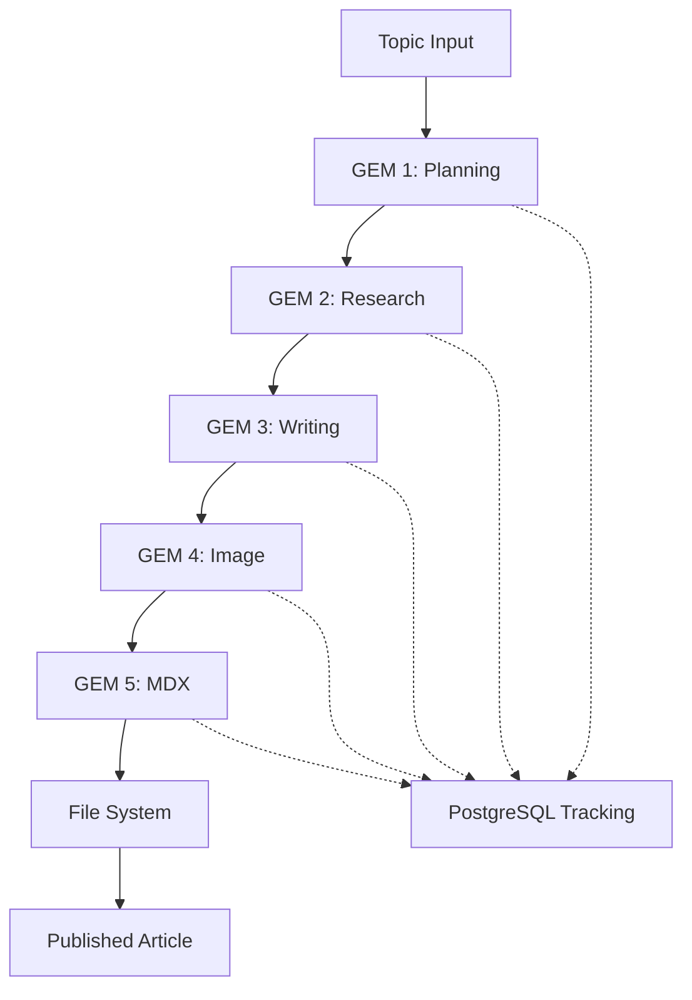
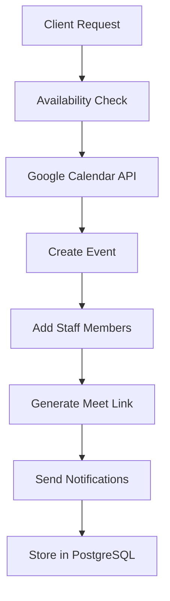
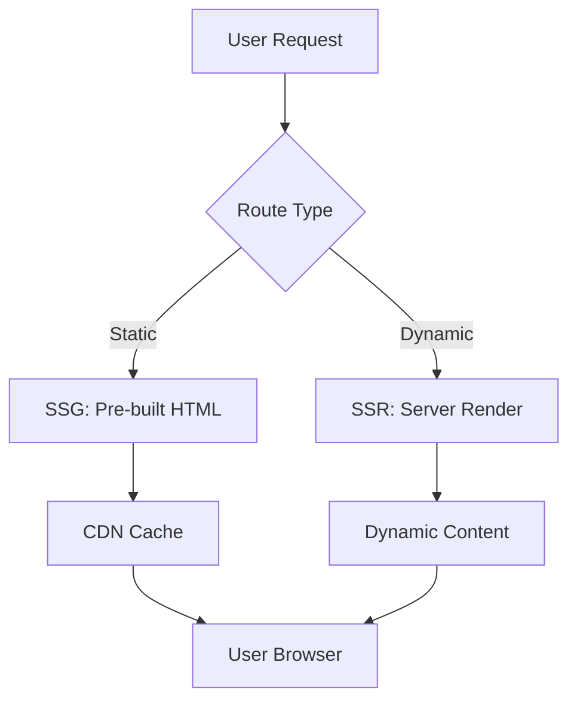

# Arquitectura General - Web IA Punto

**Versión:** 1.0  
**Fecha:** Enero 2025  
**Estado del Proyecto:** Producción (Refactorización en curso)

## 🎯 Visión de Alto Nivel

**Web IA Punto** es una aplicación web moderna que combina un sitio corporativo con funcionalidades avanzadas de automatización. El proyecto implementa un enfoque híbrido que integra generación automática de contenido con IA, agendamiento inteligente y un CMS interno robusto.

### Valor de Negocio

- **Automatización completa** de marketing de contenidos
- **Reducción de carga operacional** en gestión de citas
- **Optimización SEO** automática para posicionamiento
- **Experiencia de usuario** superior con carga rápida

## 🏗️ Arquitectura de Solución

### Stack Tecnológico Actual

#### Frontend Layer

```
Astro v5.4.2 (SSG/SSR Híbrido)
├── React v19.0.0 (Componentes interactivos)
├── TypeScript v5.8.2 (Type safety)
├── Tailwind CSS v3.4.17 (Styling)
└── Flowbite v2.5.2 (UI Components)
```

#### Backend Layer

```
Node.js 18+ (Runtime)
├── Astro API Routes (RESTful endpoints)
├── Middleware (Security, Auth, Logging)
└── Services Layer (Business logic)
```

#### Data Layer

```
PostgreSQL (Primary - Tracking, Appointments)
├── SQLite (Local development)
├── Better-SQLite3 (ORM alternativo)
└── File System (MDX content)
```

#### External Services

```
Google Services
├── Gemini API (Content generation)
├── Calendar API (Appointments)
├── Imagen API (Cover generation)
└── OAuth2 (Authentication)

Media & Communication
├── Cloudinary (Image management)
├── Resend (Email service)
└── React Email (Email templates)
```

#### Deployment & DevOps

```
Railway (Platform)
├── Docker (Containerization)
├── GitHub Actions (CI/CD)
└── GitHub (Version control)
```

## 🏛️ Patrones Arquitectónicos

### 1. Patrón de Capas (Layered Architecture)

```
┌─────────────────────────────────────┐
│           Presentation              │
│  (Astro Pages + React Components)   │
├─────────────────────────────────────┤
│            Application              │
│     (API Routes + Middleware)       │
├─────────────────────────────────────┤
│             Services                │
│  (GemArticleService, OAuth2Service) │
├─────────────────────────────────────┤
│              Data                   │
│    (PostgreSQL + File System)       │
└─────────────────────────────────────┘
```

### 2. Patrón de Servicios (Service-Oriented)

#### Servicios Principales

- **[GemArticleService](file://c:\laragon\www\web-iapunto\src\lib\services\gemArticleService.ts)** - Generación automática de artículos
- **[OAuth2Service](file://c:\laragon\www\web-iapunto\src\lib\services\oauth2Service.ts)** - Autenticación con Google
- **[ArticlePublisherService](file://c:\laragon\www\web-iapunto\src\lib\services\articlePublisherService.ts)** - Publicación de contenido
- **[EmailService](file://c:\laragon\www\web-iapunto\src\lib\services\emailService.ts)** - Comunicaciones por email

#### Servicios de Soporte

- **[ArticleTrackingService](file://c:\laragon\www\web-iapunto\src\lib\database\articleTrackingSchema.ts)** - Persistencia y tracking
- **[PostgresAppointmentService](file://c:\laragon\www\web-iapunto\src\lib\database\postgresAppointmentService.ts)** - Gestión de citas

### 3. Patrón de Middleware

```typescript
// Flujo de Middleware en src/middleware.ts
Request → Security Headers → CORS → Authentication → Route Handler
```

**Implementaciones:**

- **Security:** CSP, HSTS, XSS Protection, Frame Options
- **Caching:** Cache-Control dinámico por tipo de recurso
- **Redirects:** SEO-friendly URL normalization

### 4. Patrón de Fachada (Facade)

#### API RESTful Unificada

```
/api/
├── calendar/     # Gestión de citas (15+ endpoints)
├── articles/     # Sistema de artículos (5+ endpoints)
├── email/        # Notificaciones por email
└── debug/        # Herramientas de debugging
```

## 🔄 Flujos de Datos Principales

### 1. Flujo de Generación de Artículos



### 2. Flujo de Agendamiento



### 3. Flujo de Renderizado (Astro Híbrido)



## 📁 Estructura de Directorios

### Estructura Lógica por Dominio

```
src/
├── components/           # UI Components
│   ├── emails/          # Email templates (React Email)
│   └── ui/              # Reusable UI components
├── content/             # Content management
│   ├── services/        # Service definitions
│   └── config.ts        # Content configuration
├── lib/                 # Business logic layer
│   ├── services/        # 🔥 Core business services
│   ├── database/        # 🔥 Data persistence layer
│   ├── constants/       # Static data and configuration
│   ├── types/           # TypeScript definitions
│   └── utils/           # Utility functions
├── pages/               # 🔥 Routes and API endpoints
│   ├── api/             # RESTful API (30+ endpoints)
│   └── [pages].astro    # Static/dynamic pages
├── scripts/             # 🔥 Internal tooling and maintenance
└── styles/              # Global styles
```

### Scripts por Categoría

```
scripts/
├── active/              # 🟢 Production scripts (2)
│   ├── automated-article-creator.ts
│   └── article-monitor.ts
├── deprecated/          # 🔴 Obsolete scripts (37+)
├── testing/             # 🟡 Development testing (20+)
├── analysis/            # 🔵 Data analysis tools (5)
├── gem-system/          # 🟢 GEM system tools (3)
├── railway-setup/       # 🟡 Deployment setup (4)
└── [other categories]/  # 🟡 Various utilities
```

## 🔒 Seguridad y Autenticación

### Medidas de Seguridad Implementadas

#### 1. Headers de Seguridad (Middleware)

```typescript
// CSP, HSTS, XSS Protection, Frame Options
'Content-Security-Policy': "default-src 'self'; script-src 'self' 'unsafe-inline' https://..."
'Strict-Transport-Security': 'max-age=63072000; includeSubDomains; preload'
'X-Frame-Options': 'SAMEORIGIN'
'X-Content-Type-Options': 'nosniff'
```

#### 2. Autenticación Multi-Modal

- **Google OAuth2** - Para acceso completo a Calendar
- **Service Account** - Para automatización sin intervención
- **JWT Tokens** - Para sesiones internas (futuro CMS)

#### 3. Validación de Entrada

- **Zod schemas** - Validación de tipos en runtime
- **SQL injection prevention** - Queries parametrizadas
- **XSS protection** - Sanitización de contenido

#### 4. Gestión de Secretos

```bash
# Variables sensibles en Railway
GOOGLE_PRIVATE_KEY=       # Service Account key
GOOGLE_CLIENT_SECRET=     # OAuth2 secret
CLOUDINARY_API_SECRET=    # Image management
DATABASE_PUBLIC_URL=      # PostgreSQL connection
```

## ⚡ Rendimiento y Optimización

### Estrategias de Performance

#### 1. Renderizado Híbrido (Astro)

- **SSG** para contenido estático (páginas de servicio, blog)
- **SSR** para contenido dinámico (agendamiento, APIs)
- **Partial hydration** - Solo componentes interactivos

#### 2. Optimización de Assets

```typescript
// Image optimization (Astro + Sharp)
{ width: 1200, height: 630, crop: 'fill' }
{ quality: 'auto', fetch_format: 'auto' }

// JavaScript splitting
chunks: 'all'  // Automatic code splitting
```

#### 3. Caching Strategy

```typescript
// Static assets: 1 year cache
'Cache-Control': 'public, max-age=31536000, immutable'

// HTML pages: No cache (dynamic content)
'Cache-Control': 'public, max-age=0, must-revalidate'
```

#### 4. Database Optimization

```sql
-- Índices para queries frecuentes
CREATE INDEX idx_articles_status ON articles_tracking(status);
CREATE INDEX idx_appointments_start_time ON appointments(start_time);
```

### Métricas de Performance Actual

- **Time to First Byte:** < 200ms
- **Largest Contentful Paint:** < 2.5s
- **Cumulative Layout Shift:** < 0.1
- **First Input Delay:** < 100ms

## 🔧 Configuración y Deployment

### Configuración de Entorno

#### Development

```bash
# Local development
pnpm install
pnpm run dev          # http://localhost:4321

# Database local (SQLite)
DB_NAME=local_iapunto.db
```

#### Production (Railway)

```bash
# Build optimizado
pnpm run build       # usa astro.config.railway.mjs
pnpm run preview     # puerto 4321

# Database (PostgreSQL)
DATABASE_PUBLIC_URL=postgresql://...
```

### Docker Multi-Stage

```dockerfile
# Dockerfile con optimización para Railway
FROM node:18-alpine AS builder
# ... build steps
FROM node:18-alpine AS runner
# ... production runtime
```

### CI/CD Pipeline

```yaml
# GitHub Actions → Railway
Trigger: Push to main
Steps: 1. Install dependencies
  2. Run build
  3. Deploy to Railway
  4. Health checks
```

## 🚨 Puntos de Dolor Arquitectónicos

### 1. Complejidad de Scripts (Identificado en Auditoría)

- **93 scripts totales** con solo 2 activos
- **Mantenimiento complejo** de herramientas obsoletas
- **Documentación fragmentada** entre scripts

### 2. Dependencias Externas Críticas

- **Google APIs** como punto único de fallo
- **Sin fallbacks robustos** para servicios externos
- **Costo operacional alto** en tokens de IA

### 3. Arquitectura de Servicios Acoplada

- **GEM System** con 5 etapas secuenciales
- **Calendar System** con dual auth complexity
- **Error propagation** entre servicios

### 4. Performance de Database

- **Múltiples schemas** (PostgreSQL + SQLite)
- **Queries no optimizadas** en servicios complejos
- **Conexiones no pooled** en algunos servicios

## 🎯 Roadmap de Arquitectura

### Fase 2: Simplificación (En Progreso)

- **Consolidar sistema GEM** de 5 a 3 etapas
- **Unificar métodos de autenticación** de Calendar
- **Optimizar estructura de base de datos**

### Fase 3: Robustez

- **Implementar circuit breakers** para APIs externas
- **Cache distribuido** para mejorar performance
- **Connection pooling** para base de datos

### Fase 4: Escalabilidad

- **Microservices separation** para componentes independientes
- **Event-driven architecture** para desacoplar servicios
- **Horizontal scaling** preparation

## 📊 Métricas de Salud del Sistema

### Métricas Operacionales

```typescript
interface SystemHealth {
  articlesGenerated: number; // Por día/mes
  appointmentsBooked: number; // Tasa de conversión
  apiLatency: number; // Tiempo de respuesta promedio
  errorRate: number; // % de fallos por servicio
}
```

### Monitoring Actual

- **Manual health checks** via scripts
- **Railway built-in monitoring** para infraestructura
- **Console logging** para debugging

### Monitoring Deseado (Fase 4)

- **Prometheus + Grafana** para métricas
- **Alert manager** para notificaciones
- **APM tooling** para performance

## 📚 Referencias Arquitectónicas

### Documentación Técnica

- **[Sistema GEM](file://c:\laragon\www\web-iapunto\docs\GEM_SYSTEM.md)** - Generación automática de artículos
- **[Sistema Calendar](file://c:\laragon\www\web-iapunto\docs\CALENDAR_SYSTEM.md)** - Agendamiento inteligente

### Código Fuente Crítico

- **Services:** `src/lib/services/`
- **Database:** `src/lib/database/`
- **API Routes:** `src/pages/api/`
- **Configuration:** `astro.config.mjs`, `gem-config.json`

### Frameworks y Herramientas

- **[Astro Documentation](https://docs.astro.build/)**
- **[Railway Deployment](https://railway.app/)**
- **[Google Calendar API](https://developers.google.com/calendar/api)**
- **[Google Gemini API](https://ai.google.dev/gemini-api/docs)**

---

_Documentación de arquitectura generada durante Fase 1 - Estabilización_
